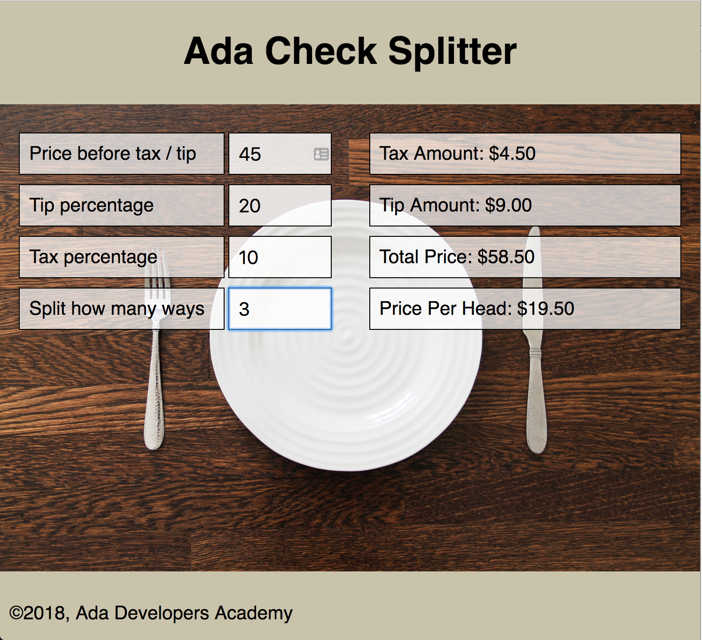

# Check Splitter

## Learning Goals

- Practice with stateless functional components
- Practice with container components

## Instructions

This is an in-class exercise, and will not be submitted.

Once you're finished with all waves, you should have something like this:



### Setup

```
$ git clone <paste-URI-here>
$ cd react-check-splitter
$ npm install
$ npm start
```

### Wave 1: Reading Code

This app is a partially implemented check splitter. It will take a subtotal, tax and tip percentages, and a number of ways to split the bill, and tell you how much each person should pay.

Read through the existing code, and answer the following questions:
- Are there any functional stateless components in this code?
  - What do they display?
- Are there any container components in this code?
  - What state do they manage?
- Is `CheckForm` a controlled or uncontrolled form?
  - If it's controlled, where does the state live?
- What happens when you type in one of the input boxes?
  - What components (if any) are re-rendered?
- What does `CheckForm.buildInput()` do? How is it used?
  - Could `buildInput()` be a separate functional stateless component? How would this be different? Why do you think we chose not to build it this way?

Pay careful attention to the last question - when learning a new pattern, it's important to identify when it _doesn't_ apply too.

### Wave 2: Managing State in a Container Component

Let's start by doing some work with this app's container component, `CheckSplitterContainer`. Currently all this component does is manage the form state, but for this app we'll need a little more.

Take a look at the `calculateSplit()` function. Your first job is to fill this out. Based on the numbers the user has typed into the form, figure out the tax amount, tip amount, total price with tax and tip, and price per head after splitting. You should return all 4 numbers in one object (like it is now).

We don't have anywhere to display these numbers yet. For now, call `calculateSplit()` from `render()` and `console.log` the result.

### Wave 3: Displaying Data with a Functional Stateless Component

Our next step is to display the info from `calculateSplit()` to the user. However, because `CheckSplitterContainer` is a container, we don't want to put display logic there. Instead we will use a separate component `SplitInfo` to show these numbers.

`SplitInfo` should be a functional stateless component. It should take 4 props, one for each of the values calculated in wave 2, and display them to the user.

## Wrap-Up

In this exercise, we worked with a container component, `CheckSplitterContainer`. This component manages state and passes it into other components, but does not draw any HTML itself.

We also worked with a functional stateless component, `SplitInfo`. This component doesn't manage any state itself, but instead consumes data from a parent component via props and turns it into HTML. It is defined using React's function syntax.

Additionally, we saw a place where neither of these patterns makes sense: a component that doesn't manage its own state, but is complex enough to need some helper methods, so is still implemented as a class.
